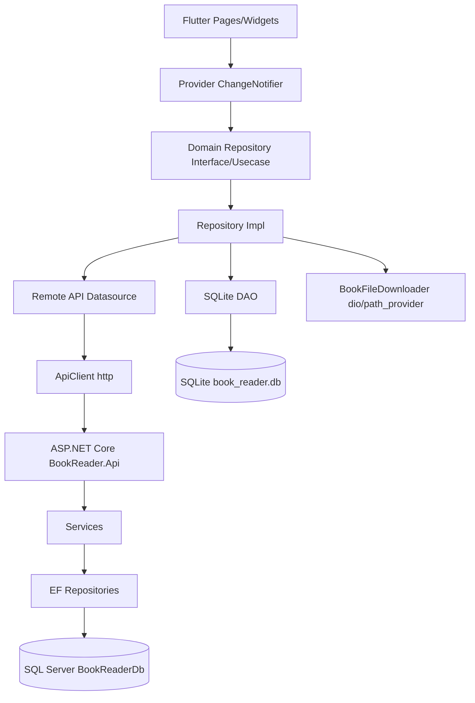
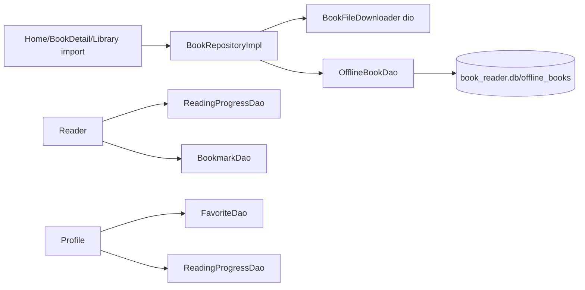

# HỒ SƠ KIẾN TRÚC DỰ ÁN HIỆN TẠI

## 1. Tổng quan dự án

- **Tên dự án:** `book_reader`, khai báo trong `pubspec.yaml`.
- **Mục tiêu hiện tại dựa trên source code:** ứng dụng đọc sách có đăng nhập/đăng ký, tìm kiếm sách, xem chi tiết, thêm vào tủ sách, lưu offline bằng SQLite, đọc qua WebView hoặc text, lưu tiến độ đọc, bookmark, bình luận local, hồ sơ người dùng, tin tức LitHub và gói thành viên. Bằng chứng: `lib/main.dart`, `lib/presentation/pages/home/home.dart`, `lib/presentation/pages/book_detail/book_detail_page.dart`, `lib/presentation/pages/reader/reader.dart`, `lib/presentation/pages/library/library_page.dart`, `lib/presentation/pages/communicate/news_page.dart`, `lib/presentation/pages/membership/membership_package_page.dart`.
- **Backend hiện có:** ASP.NET Core Web API .NET 8 trong `backend/BookReader.Api`, dùng SQL Server/Entity Framework Core. Bằng chứng: `backend/BookReader.Api/BookReader.Api.csproj`, `backend/BookReader.Api/Program.cs`, `backend/BookReader.Api/Data/BookReaderDbContext.cs`.
- **Nền tảng hỗ trợ:** có thư mục Flutter mặc định cho `android/`, `ios/`, `web/`, `windows/`, `macos/`, `linux/`.
- **Loại ứng dụng:** Flutter mobile app là trọng tâm; web/desktop có scaffold mặc định nhưng chưa thấy xử lý riêng cho từng nền tảng.
- **Mức độ hoàn thiện hiện tại:** Incomplete. Project có nhiều thành phần quan trọng cho đồ án Mobile Programming nhưng còn lẫn code mẫu/placeholder, một số provider trùng tên, một số màn hình chưa nối route chính thức, Firebase chưa có, và chưa xác minh được analyze/test/build do lệnh Flutter/Dart bị timeout trong môi trường hiện tại.

## 2. Công nghệ và thư viện

| Nhóm công nghệ | Dependency/package | Phiên bản | Mục đích sử dụng trong project | File/vị trí đang sử dụng |
| --- | --- | --- | --- | --- |
| Flutter SDK | `flutter` | SDK | Xây dựng UI Flutter | `pubspec.yaml`, toàn bộ `lib/` |
| Dart SDK | `sdk` | `^3.10.7` | Ngôn ngữ/runtime | `pubspec.yaml` |
| UI icon | `cupertino_icons` | `^1.0.8` | Icon Cupertino; chưa thấy import trực tiếp trong `lib/` | `pubspec.yaml` |
| HTTP/API | `http` | `^1.6.0` | Gọi backend API JSON và LitHub API | `lib/core/services/http/api_client.dart`, `lib/presentation/state/news_provider.dart` |
| HTTP/download | `dio` | `^5.9.2` | Tải file PDF/EPUB về local | `lib/data/datasources/local/file_cache/book_file_downloader.dart` |
| State management | `provider` | `^6.1.5+1` | `MultiProvider`, `ChangeNotifierProvider`, `context.watch/read`, `Consumer` | `lib/main.dart`, `lib/presentation/state/*.dart`, `lib/presentation/pages/**/*.dart` |
| SQLite | `sqflite` | `^2.4.2+1` | Local database `book_reader.db` | `lib/data/datasources/local/sqlite/app_database.dart`, `lib/data/datasources/local/dao/*.dart` |
| Path | `path` | `^1.9.0` | Join path database/file | `lib/data/datasources/local/sqlite/app_database.dart`, `lib/data/datasources/local/file_cache/book_file_downloader.dart` |
| Local file path | `path_provider` | `^2.1.5` | Lưu session và file sách trong app documents | `lib/core/services/local_storage/session_storage.dart`, `lib/data/datasources/local/file_cache/book_file_downloader.dart` |
| URL/device | `url_launcher` | `^6.3.2` | Mở link bài viết LitHub bằng app ngoài | `lib/presentation/pages/communicate/news_page.dart` |
| File/device | `file_picker` | `^8.1.4` | Import file `pdf`, `epub`, `txt` vào thư viện | `lib/presentation/pages/library/library_page.dart` |
| File/device | `open_filex` | `^4.7.0` | Có khai báo nhưng chưa thấy import trong `lib/` | `pubspec.yaml` |
| WebView | `webview_flutter` | `^4.13.1` | Đọc online bằng Google Books `webReaderLink`/`previewLink` | `lib/presentation/pages/reader/reader.dart` |
| HTML parser | `html` | `^0.15.6` | Parse/xóa HTML trong dữ liệu LitHub | `lib/data/models/news_model.dart` |
| Test | `flutter_test` | SDK | Test widget mặc định | `test/widget_test.dart` |
| Lint | `flutter_lints` | `^6.0.0` | Quy tắc lint | `analysis_options.yaml`, `pubspec.yaml` |
| Backend | ASP.NET Core | `net8.0` | Web API | `backend/BookReader.Api/BookReader.Api.csproj` |
| Backend ORM | `Microsoft.EntityFrameworkCore` | `9.0.0` | Entity Framework Core | `backend/BookReader.Api/BookReader.Api.csproj`, `backend/BookReader.Api/Data/BookReaderDbContext.cs` |
| Backend DB provider | `Microsoft.EntityFrameworkCore.SqlServer` | `9.0.0` | Kết nối SQL Server | `backend/BookReader.Api/Program.cs` |
| Backend docs | `Swashbuckle.AspNetCore` | `6.4.0` | Swagger/OpenAPI | `backend/BookReader.Api/Program.cs` |

**Firebase:** Missing. Không có dependency `firebase_core`, `firebase_auth`, `cloud_firestore`, `firebase_storage` trong `pubspec.yaml`; chỉ có placeholder `lib/data/datasources/remote/firebase/firebase.md`.

**Routing package riêng:** Missing. Project dùng `MaterialApp.routes` và `Navigator`, không dùng `go_router`, `auto_route` hoặc GetX. Bằng chứng: `lib/app.dart`, `lib/config/routes.dart`.

## 3. Cấu trúc thư mục tổng quan

```text
book_reader/
├── lib/
│   ├── app.dart
│   ├── main.dart
│   ├── config/
│   │   ├── routes.dart
│   │   └── theme/
│   ├── core/
│   │   ├── constants/
│   │   ├── services/
│   │   └── widgets/
│   ├── data/
│   │   ├── datasources/
│   │   │   ├── local/
│   │   │   └── remote/
│   │   └── models/
│   ├── domain/
│   │   ├── entities/
│   │   ├── repositories/
│   │   └── usecases/
│   └── presentation/
│       ├── pages/
│       └── state/
├── backend/
│   └── BookReader.Api/
│       ├── Controllers/
│       ├── Data/
│       ├── DTOs/
│       ├── Entities/
│       ├── Helpers/
│       ├── Repositories/
│       └── Services/
├── assets/
│   ├── images/
│   ├── icons/
│   ├── fonts/
│   ├── l10n/
│   └── sample_data/
├── test/
├── docs/
├── android/ ios/ web/ windows/ macos/ linux/
├── pubspec.yaml
└── README.md
```

| Thư mục | Vai trò hiện tại | Bằng chứng |
| --- | --- | --- |
| `lib/config` | Route và theme | `lib/config/routes.dart`, `lib/config/theme/app_theme.dart` |
| `lib/core/constants` | Hằng số ảnh/text/API | `api_constants.dart`, `my_images.dart`, `my_text.dart`, `templateImage.dart` |
| `lib/core/services` | HTTP client, session local file, launcher/download support | `api_client.dart`, `session_storage.dart`, `book_reader_launcher.dart` |
| `lib/core/widgets` | Widget dùng lại cho auth/home/profile | `ShareWidgetAuth/form.dart`, `ShareWidgetHome/wbook.dart`, `ShareWidgetProfile/item.dart` |
| `lib/data/models` | Model chuyển đổi JSON/SQLite | `book_model.dart`, `user_model.dart`, `news_model.dart` |
| `lib/data/datasources/local` | SQLite database, DAO, file cache | `sqlite/app_database.dart`, `dao/*.dart`, `file_cache/book_file_downloader.dart` |
| `lib/data/datasources/remote/api` | API datasource | `auth_api.dart`, `google_books_api.dart`, `library_api.dart`, `membership_api.dart`, `bookmark_api.dart`, `reading_progress_api.dart` |
| `lib/domain` | Entity, repository interface/impl, use case | `entities/book.dart`, `repositories/book_repository.dart`, `usecases/search_books.dart` |
| `lib/presentation/pages` | UI screens | `auth/`, `home/`, `library/`, `reader/`, `profile/`, `membership/` |
| `lib/presentation/state` | Provider/ChangeNotifier state | `auth_provider.dart`, `library_provider.dart`, `membership_provider.dart`, `news_provider.dart` |
| `backend/BookReader.Api` | Backend API .NET 8 | `Program.cs`, `Controllers/*.cs`, `Data/BookReaderDbContext.cs` |

**Incomplete:** có nhiều file `.md` placeholder như `lib/presentation/pages/bookmarks/bookmarks.md`, `lib/presentation/pages/search/tmp.md`, `lib/core/error/error.md`, `lib/data/repositories/repositories.md`; chưa phải implementation.

## 4. Luồng khởi động ứng dụng

| File/class/hàm | Chức năng |
| --- | --- |
| `lib/main.dart` / `main()` | Khởi tạo `ApiClient`, các API datasource, `SessionStorage`, `AppDatabase.instance`, DAO, `BookFileDownloader`, repository và `MultiProvider`. |
| `MultiProvider` trong `main()` | Cung cấp `BookRepository`, `AuthProvider`, `HomeBookProvider`, `NewsProvider`, `LibraryProvider`, `MembershipProvider`. |
| `lib/app.dart` / `Application` | Widget gốc `StatelessWidget`, trả về `MaterialApp`. |
| `MaterialApp` | `debugShowCheckedModeBanner: false`, `theme: AppTheme.light`, `initialRoute: AppRoute.splash`, `routes: AppRoute.routes`. |
| `lib/config/routes.dart` / `AppRoute` | Định nghĩa route: `/`, `/login`, `/signin`, `/signup`, `/forgotpassword`, `/verify`, `/newpassword`, `/homescreen`, `/membership`, `/book-detail`. |
| `lib/presentation/pages/splash/splash_page.dart` | Delay 2 giây, gọi `AuthProvider.loadSession()`, chuyển tới `/homescreen` nếu đã có session hoặc `/login` nếu chưa có. |
| `lib/config/theme/app_theme.dart` | Theme hiện chỉ dùng `ThemeData(useMaterial3: true)`. |

```mermaid
flowchart TD
  A[main.dart main] --> B[Create ApiClient, APIs, SQLite DAO, Repositories]
  B --> C[MultiProvider]
  C --> D[Application]
  D --> E[MaterialApp initialRoute /]
  E --> F[SplashPage]
  F --> G[AuthProvider.loadSession]
  G -->|Có session| H[/homescreen Homescreen]
  G -->|Không có session| I[/login Login]
```

**Firebase init:** Missing. Không thấy `Firebase.initializeApp()` hoặc `firebase_options.dart`.

## 5. Kiến trúc tổng thể hiện tại

Project đang cố gắng theo **layered architecture pha Clean Architecture nhẹ** ở Flutter:

- **Presentation/UI layer:** `lib/presentation/pages/**`, widget dùng lại trong `lib/core/widgets/**`.
- **State management/controller layer:** `ChangeNotifier` trong `lib/presentation/state/*.dart` và một số provider nằm lẫn trong page folder như `lib/presentation/pages/home/home_book_provider.dart`, `lib/presentation/pages/library/library_provider.dart`.
- **Domain layer:** `lib/domain/entities`, `lib/domain/repositories`, `lib/domain/usecases`.
- **Data layer:** `lib/data/models`, `lib/data/datasources/local`, `lib/data/datasources/remote/api`.
- **Local datasource:** SQLite qua `sqflite` trong `lib/data/datasources/local/sqlite/app_database.dart`.
- **Remote datasource:** backend API qua `ApiClient` và LitHub API trực tiếp trong `NewsProvider`.
- **Backend architecture:** `Controller -> Service -> Repository -> Entity/DbContext`. Bằng chứng: `backend/BookReader.Api/Program.cs` đăng ký scoped repository/service; thư mục `Controllers`, `Services`, `Repositories`, `Entities`.



| Điểm mạnh | Bằng chứng |
| --- | --- |
| Có tách lớp Flutter tương đối rõ | `config`, `core`, `data`, `domain`, `presentation` |
| Có repository interface cho sách/auth | `lib/domain/repositories/book_repository.dart`, `auth_repository.dart` |
| Có SQLite local thực tế | `lib/data/datasources/local/sqlite/app_database.dart`, `dao/*.dart` |
| Có backend API theo tầng | `backend/BookReader.Api/Program.cs`, `Controllers`, `Services`, `Repositories` |

| Điểm yếu | Bằng chứng |
| --- | --- |
| Provider bị trùng vị trí/tên, dễ import nhầm | `lib/presentation/pages/home/home_book_provider.dart` và `lib/presentation/state/home_book_provider.dart`; `lib/presentation/pages/library/library_provider.dart` và `lib/presentation/state/library_provider.dart` |
| Một số use case tồn tại nhưng không phải luồng chính | `lib/domain/usecases/*.dart`, trong `main.dart` không inject use case |
| Hardcode `userId: 1` ở nhiều luồng | `LibraryProvider`, `MembershipProvider`, `Reader` |
| Auth fallback mock làm đăng nhập luôn thành công khi API lỗi | `AuthProvider._runAuth()` |
| Firebase placeholder nhưng chưa tích hợp | `lib/data/datasources/remote/firebase/firebase.md`, `pubspec.yaml` |

## 6. Danh sách màn hình và điều hướng

| STT | Màn hình | File path | Widget/class chính | Chức năng | Cách truy cập/route | Dữ liệu sử dụng | Trạng thái |
| --- | --- | --- | --- | --- | --- | --- | --- |
| 1 | Splash | `lib/presentation/pages/splash/splash_page.dart` | `SplashPage` | Kiểm tra session, chuyển hướng | `/` | `AuthProvider.loadSession`, `SessionStorage` | Hoạt động cơ bản |
| 2 | Login landing | `lib/presentation/pages/auth/login.dart` | `Login` | Màn chọn Sign in/Sign up | `/login` | Asset banner/text | Hoạt động cơ bản |
| 3 | Sign in | `lib/presentation/pages/auth/sign_in.dart` | `Signin` | Đăng nhập form email/password | `/signin` | `AuthProvider.login`, `AuthApi` | Incomplete: fallback mock khi API lỗi |
| 4 | Sign up | `lib/presentation/pages/auth/sign_up.dart` | `Signup` | Đăng ký tài khoản | `/signup` | `AuthProvider.register`, `AuthApi` | Incomplete: validation còn đơn giản |
| 5 | Forgot password | `lib/presentation/pages/auth/forgot_password.dart` | `Forgotpassword` | Nhập email/phone quên mật khẩu | `/forgotpassword` | UI local | Incomplete: chưa thấy API reset password |
| 6 | Verify info | `lib/presentation/pages/auth/verify_info.dart` | `Verifyinfo` | Xác minh thông tin | `/verify` | UI local | Incomplete |
| 7 | New password | `lib/presentation/pages/auth/new_password.dart` | `NewPassword` | Đặt mật khẩu mới | `/newpassword` | UI local/dialog | Incomplete: chưa thấy API |
| 8 | Main shell | `lib/presentation/pages/home/homescreen.dart` | `Homescreen` | Bottom navigation 4 tab | `/homescreen` | `IndexedStack` | Hoạt động, nhưng tab Library đang mở `CategoryPage` |
| 9 | Home | `lib/presentation/pages/home/home.dart` | `Home` | Search, danh sách sách theo section, lưu sách | Trong `Homescreen` tab Home | `HomeBookProvider`, `BookRepository` | Hoạt động cơ bản |
| 10 | Category | `lib/presentation/state/category/category_page.dart` | `CategoryPage` | Danh sách thể loại, mở Library nếu chọn Downloaded | Trong `Homescreen` tab Library | `BookProvider` khi search | Incomplete: các category khác chỉ `debugPrint` |
| 11 | Library/Downloaded | `lib/presentation/pages/library/library_page.dart` | `LibraryPage` | Danh sách sách lưu, import file, đọc/xóa | Từ `CategoryPage` item Downloaded | `LibraryProvider`, `FilePicker`, `BookRepository` | Hoạt động một phần |
| 12 | Book Detail | `lib/presentation/pages/book_detail/book_detail_page.dart` | `BookDetailPage` | Xem chi tiết, favorite, thêm tủ sách, đọc | `/book-detail`, argument `book.id` | `BookRepository`, `FavoriteDao`, `LibraryProvider` | Hoạt động cơ bản |
| 13 | Reader | `lib/presentation/pages/reader/reader.dart` | `Reader` | Đọc WebView/text, lưu progress, bookmark, comment | `MaterialPageRoute` từ detail/library | `ReadingProgressDao`, `BookmarkDao`, `ReadingProgressApi`, `BookmarkApi`, `WebView` | Incomplete: PDF/EPUB chưa render trực tiếp |
| 14 | Comment | `lib/presentation/pages/comment/comments.dart` | `CommentPage` | Xem/thêm bình luận local | Từ `Reader` | `CommentDao`, `AuthProvider` | Hoạt động local |
| 15 | News | `lib/presentation/pages/communicate/news_page.dart` | `NewsPage` | Tin tức LitHub, search local, mở link ngoài | Trong `Homescreen` tab Communicate | `NewsProvider`, LitHub API, `url_launcher` | Hoạt động phụ thuộc mạng |
| 16 | Profile | `lib/presentation/pages/profile/myprofile.dart` | `Myprofile` | Hồ sơ, thống kê, favorite, history, logout, membership | Trong `Homescreen` tab Profile; từ Home avatar | `AuthProvider`, `LibraryProvider`, `FavoriteDao`, `ReadingProgressDao`, `ProfileDao` | Hoạt động một phần |
| 17 | Edit Profile | `lib/presentation/pages/profile/editprofile.dart` | `EditProfilePage` | Sửa thông tin profile | Từ `Myprofile` | `ProfileDao`, `AuthProvider` | Hoạt động local |
| 18 | Membership | `lib/presentation/pages/membership/membership_package_page.dart` | `MembershipPackageScreen` | Xem gói, subscribe | `/membership` | `MembershipProvider`, `MembershipApi` | Hoạt động nếu backend chạy |
| 19 | Details cũ | `lib/presentation/pages/details/details.dart` | `Details` | Màn chi tiết cũ/demo | `Navigator.push` từ một số widget cũ | Data truyền thủ công | Need verification |
| 20 | Search demo | `lib/presentation/test.dart` | `SearchPage` | Search/GridView demo | Không thấy route chính | `BookProvider` | Incomplete/demo |

## 7. Phân tích UI/UX và widget Flutter

| Tiêu chí | Có/Không | File minh chứng | Ghi chú |
| --- | --- | --- | --- |
| `Scaffold` | Có | `sign_in.dart`, `home.dart`, `library_page.dart`, `reader.dart`, `myprofile.dart` | Dùng rộng rãi |
| `AppBar` | Có | `home.dart`, `library_page.dart`, `book_detail_page.dart`, `reader.dart`, `news_page.dart` | Có title/action |
| `Drawer` | Có | `home.dart`, `homescreen.dart` | Nội dung còn placeholder `Menu` |
| `BottomNavigationBar` | Có | `homescreen.dart` | 4 tab: Home, Library, Communicate, Profile |
| `ListView` | Có | `home.dart`, `library_page.dart`, `category_page.dart`, `news_page.dart`, `reader.dart` | Dùng ngang/dọc |
| `GridView` | Có | `lib/presentation/test.dart` | Chỉ thấy ở màn demo `SearchPage`, chưa vào route chính |
| `Form` | Có | `sign_in.dart`, `sign_up.dart`, `forgot_password.dart`, `verify_info.dart`, `new_password.dart`, `editprofile.dart` | Có `_formKey` ở auth/edit |
| `TextFormField` | Có | `core/widgets/ShareWidgetAuth/form.dart`, `core/widgets/ShareWidgetHome/form.dart`, `editprofile.dart` | Widget dùng lại |
| `TextField` | Có | `category_page.dart`, `news_page.dart`, `comments.dart`, `presentation/test.dart` | Search/comment |
| Validation | Có một phần | `sign_in.dart`, `sign_up.dart`, `editprofile.dart` | Chủ yếu kiểm tra rỗng và confirm password; email/password constraints chưa chặt |
| Dialog | Có | `reader.dart`, `library_page.dart`, `new_password.dart` | Exit/bookmark/delete dialogs |
| Snackbar | Có | `sign_in.dart`, `sign_up.dart`, `home.dart`, `library_page.dart`, `book_detail_page.dart`, `reader.dart`, `news_page.dart` | Báo lỗi/thành công |
| Loading state | Có | `CircularProgressIndicator`, `LinearProgressIndicator` trong nhiều page/provider | Home/library/news/membership/auth/reader |
| Error state | Có một phần | `home.dart`, `library_page.dart`, `book_detail_page.dart`, `news_page.dart` | Có hiển thị text lỗi |
| Empty state | Có một phần | `home.dart`, `library_page.dart`, `news_page.dart`, `myprofile.dart` | Có text khi rỗng |
| Responsive/adaptive layout | Incomplete | Không thấy `LayoutBuilder`/breakpoint rõ | Chủ yếu layout cố định/scroll |
| Custom widget reusable | Có | `core/widgets/ShareWidgetAuth`, `ShareWidgetHome`, `ShareWidgetProfile` | Một số tên folder/class chưa chuẩn Dart style |
| Theme/style riêng | Có rất nhẹ | `AppTheme.light` | Chỉ bật Material 3, style còn rải trong page |

**Kết luận UI:** Đạt một phần yêu cầu môn học: có nhiều màn hình, navigation, ListView, form, loading/error/empty state. Còn thiếu chuẩn hóa UX, responsive, theme tập trung và GridView nằm ở demo chưa nối route chính.

## 8. Models và cấu trúc dữ liệu

| Model/entity | File path | Thuộc tính chính | Mapping | Mục đích | Liên quan |
| --- | --- | --- | --- | --- | --- |
| `Book` | `lib/domain/entities/book.dart` | `id`, `title`, `authors`, `description`, `thumbnailUrl`, `categories`, `pageCount`, `language`, `previewLink`, `webReaderLink`, `source`, download/local fields | Không có | Entity domain sách | UI, repository, SQLite/API |
| `AppUser` | `lib/domain/entities/app_user.dart` | `userId`, `fullName`, `email`, `role`, `token` | Không có | Entity user | Auth/session |
| `BookModel` | `lib/data/models/book_model.dart` | Kế thừa `Book` | `fromGoogleBooksJson`, `fromBackendJson`, `fromSqlite`, `toSqliteMap`, `fromEntity`, `copyWith` | Data model sách | Google/backend/SQLite |
| `UserModel` | `lib/data/models/user_model.dart` | Kế thừa `AppUser` | `fromJson`, `toJson` | Data model auth/session | Backend auth, session file |
| `NewsModel` | `lib/data/models/news_model.dart` | `id`, `title`, `description`, `imageUrl`, `link` | `fromJson` | Tin tức LitHub | News UI/API |
| `MembershipPackageModel` | `lib/data/datasources/remote/api/membership_api.dart` | `id`, `name`, `price`, `durationDays`, `description` | `fromJson` | Gói thành viên | Membership UI/API |

**Thiếu/Incompleteness:**

- Chưa có model Dart riêng cho bookmark, reading progress, comment, profile, favorite; DAO đang trả `Map<String, dynamic>` ở `BookmarkDao`, `ReadingProgressDao`, `CommentDao`, `ProfileDao`, `FavoriteDao`.
- Backend có entity đầy đủ hơn trong `backend/BookReader.Api/Entities/*.cs`: `AppUser`, `Author`, `Book`, `Bookmark`, `Category`, `MembershipPackage`, `NoteHighlight`, `ReadingProgress`, `Review`, `UserLibrary`, `UserMembership`.

## 9. SQLite / local database / local storage

Project **có dùng SQLite** bằng package `sqflite`.

| Thành phần | Giá trị/bằng chứng |
| --- | --- |
| Package | `sqflite: ^2.4.2+1` trong `pubspec.yaml` |
| Database file | `book_reader.db` trong `lib/data/datasources/local/sqlite/app_database.dart` |
| Database singleton | `AppDatabase.instance` |
| File rỗng/không dùng rõ | `lib/data/datasources/local/app_database.dart` đang rỗng |
| Table names | `lib/data/datasources/local/tables/table_names.dart` |

| Bảng/entity | File xử lý | Create | Read | Update | Delete | Màn hình dùng | Vấn đề còn thiếu |
| --- | --- | --- | --- | --- | --- | --- | --- |
| `offline_books` | `OfflineBookDao` | `insertOrUpdateBook` | `getOfflineBooks`, `getBookById` | `insertOrUpdateBook`, `updateDownloadedFilePath` | `deleteOfflineBook` | Home save, Library list/delete, Reader open | Có lưu metadata/file path; chưa có migration/version upgrade |
| `reading_progress` | `ReadingProgressDao` | `saveProgress` insert | `getProgress`, `getAllProgress` | `saveProgress` update | Missing | Reader, Profile history | Trả Map, chưa có model |
| `bookmarks` | `BookmarkDao` | `addBookmark` | `getBookmarks` | Missing | `deleteBookmark` | Reader bookmark dialog | Chưa có update note |
| `comments` | `CommentDao` | `addComment` | `getComments` | Missing | Missing | CommentPage | CRUD chưa đầy đủ |
| `user_profile` | `ProfileDao` | `saveProfile` insert | `getProfile` | `saveProfile` update | Missing | EditProfile/Profile | Local-only |
| `favorites` | `FavoriteDao` | `addFavorite` | `isFavorite`, `getAllFavorites` | Missing | `removeFavorite` | BookDetail/Profile | Không có model riêng |

**Local storage file:** `SessionStorage` lưu `book_reader_session.json` trong app documents qua `path_provider` (`lib/core/services/local_storage/session_storage.dart`).

**Luồng local chính:**



## 10. API / networking

Project **có gọi API**.

| Thành phần | Bằng chứng |
| --- | --- |
| HTTP client chung | `lib/core/services/http/api_client.dart` |
| Base URL backend | `ApiConstants.backendBaseUrl = http://10.0.2.2:5102/api` trong `api_constants.dart` |
| Google Books base constants | `googleBooksBaseUrl`, `volumesEndpoint` trong `api_constants.dart`, nhưng luồng Flutter hiện gọi backend proxy |
| Error handling | `ApiClient._send()` bắt `SocketException`, `HttpException`, `FormatException`, unwrap `ApiResponse` |
| Loading state | Provider như `AuthProvider`, `HomeBookProvider`, `LibraryProvider`, `MembershipProvider`, `NewsProvider` |

| API datasource | Endpoint/constants | Request/response model | Màn hình dùng | Trạng thái |
| --- | --- | --- | --- | --- |
| `AuthApi` | `/auth/login`, `/auth/register` | `UserModel` | Signin/Signup/Splash session | Incomplete do fallback mock trong provider |
| `GoogleBooksApi` | `/books/google/search`, `/books`, `/books/google/{id}`, `/books/{id}` | `BookModel` | Home, BookDetail | Có fallback từ Google proxy sang SQL books |
| `LibraryApi` | `/library`, `/library/{bookId}`, `/books/import-google/{googleBookId}` | `BookModel` | LibraryProvider, BookDetail | Hardcode `userId: 1` |
| `MembershipApi` | `/membership/packages`, `/membership/subscribe/{packageId}` | `MembershipPackageModel` | Membership screen | Hardcode `userId: 1` |
| `BookmarkApi` | `/bookmarks` | Không có model riêng | Reader sync bookmark | Chỉ add/delete phía Flutter |
| `ReadingProgressApi` | `/reading-progress/{bookId}` | Không có model riêng | Reader sync progress | Chỉ save phía Flutter |
| `NewsProvider` trực tiếp | `https://lithub.com/wp-json/wp/v2/posts?per_page=15` | `NewsModel` | NewsPage | Không qua repository |

## 11. Firebase

**Missing.**

| Mục kiểm tra | Hiện trạng |
| --- | --- |
| `firebase_core` | Không có trong `pubspec.yaml` |
| `firebase_auth` | Không có trong `pubspec.yaml` |
| `cloud_firestore` | Không có trong `pubspec.yaml` |
| `firebase_storage` | Không có trong `pubspec.yaml` |
| `firebase_options.dart` | Không thấy trong `rg --files` |
| `Firebase.initializeApp()` | Không thấy trong `lib/main.dart` |
| Firestore collections | Không có bằng chứng |
| Storage | Không có bằng chứng |

**Đề xuất phù hợp cho đề tài, chưa viết code:** nếu cần Firebase cho môn học, có thể dùng Firebase Auth cho đăng nhập hoặc Firebase Storage cho ảnh đại diện/file sách demo. Tuy nhiên project hiện đã có backend auth và SQL Server, nên cần cân nhắc tránh trộn hai hệ auth.

## 12. Multimedia / thiết bị / quyền hệ thống

| Tính năng | Package | File sử dụng | Quyền Android/iOS | Mức độ hoàn thiện |
| --- | --- | --- | --- | --- |
| Import file | `file_picker` | `lib/presentation/pages/library/library_page.dart` | Need verification: chưa kiểm manifest permission riêng; file picker thường xử lý qua system picker | Có import `pdf`, `epub`, `txt` |
| Lưu file app documents | `path_provider`, `dart:io` | `BookFileDownloader`, `SessionStorage`, `Reader` | App documents internal | Có |
| Tải file | `dio` | `book_file_downloader.dart` | Internet permission cần Android; manifest cần kiểm | Có download nếu có link |
| Đọc WebView | `webview_flutter` | `reader.dart` | Internet permission cần Android; manifest cần kiểm | Có đọc online |
| Mở link ngoài | `url_launcher` | `news_page.dart` | Need verification cho platform config | Có |
| Camera | Missing | Không thấy package/import | Không có | Missing |
| Image picker | Missing | Không thấy `image_picker` | Không có | Missing |
| Audio/video | Missing | Không thấy package | Không có | Missing |
| Map/location | Missing | Không thấy package | Không có | Missing |
| Contact | Missing | Không thấy package | Không có | Missing |
| Notification | Missing | Không thấy package | Không có | Missing |
| Permission handler | Missing | Không thấy `permission_handler` | Không có | Missing |

## 13. State management

Project dùng **Provider + ChangeNotifier**, kết hợp `setState`, `FutureBuilder`, `Consumer`, `context.watch/read`.

| Kiểu state | File/class | Vai trò |
| --- | --- | --- |
| `ChangeNotifier` | `AuthProvider` | Auth loading/session/currentUser |
| `ChangeNotifier` | `HomeBookProvider` trong `lib/presentation/pages/home/home_book_provider.dart` | Home data/search/save offline |
| `ChangeNotifier` | `LibraryProvider` trong `lib/presentation/state/library_provider.dart` | Load remote/local library, add/remove book |
| `ChangeNotifier` | `MembershipProvider` | Load packages/subscribe |
| `ChangeNotifier` | `NewsProvider` | Fetch/search LitHub news |
| `setState` | `Homescreen`, `Reader`, `BookDetailPage`, `MembershipPackageScreen`, `Myprofile`, `EditProfilePage` | UI state cục bộ |
| `FutureBuilder` | `BookDetailPage`, `Reader`, `read_file_async.dart` | Async book detail/content |
| `Consumer` | `NewsPage` | Render theo `NewsProvider` |

**Ưu điểm:** dễ hiểu, phù hợp course project, đã dùng loading/error/listener ở nhiều luồng.

**Vấn đề hiện tại:**

- Trùng provider/class: `lib/presentation/pages/home/home_book_provider.dart` và `lib/presentation/state/home_book_provider.dart` khác constructor; `lib/presentation/pages/library/library_provider.dart` và `lib/presentation/state/library_provider.dart`.
- `BookProvider` trong `lib/presentation/state/book_provider.dart` được `CategoryPage`/`SearchPage` gọi nhưng không thấy đăng ký trong `MultiProvider` ở `main.dart`; Need verification vì có thể gây lỗi ProviderNotFound khi search category.
- `AuthProvider._runAuth()` bắt mọi lỗi và tạo user mock, làm sai trạng thái auth thật nếu backend lỗi.
- Hardcode user id trong `LibraryProvider`, `MembershipProvider`, `Reader`.

## 14. Luồng nghiệp vụ chính

| Luồng | Người dùng thao tác | UI liên quan | Logic/data | Kết quả | Lỗi/thiếu sót |
| --- | --- | --- | --- | --- | --- |
| Mở app | Mở ứng dụng | `SplashPage` | `AuthProvider.loadSession()` đọc `SessionStorage` | Vào `/homescreen` hoặc `/login` | Chưa verify token với backend |
| Đăng nhập | Nhập email/password, bấm Sign in | `Signin` | `AuthProvider.login` -> `AuthRepositoryImpl` -> `AuthApi.login` -> `/auth/login` | Lưu session, vào home | API lỗi vẫn tạo mock user |
| Đăng ký | Nhập họ tên/email/password/confirm | `Signup` | `AuthProvider.register` -> `/auth/register` | Lưu session, vào home | Validation đơn giản |
| Xem danh sách home | Vào Home | `Home` | `HomeBookProvider.loadHomeData()` search `harry potter` | 3 section sách | Keyword mặc định hardcode |
| Tìm kiếm sách | Nhập search ở Home | `Home` | `HomeBookProvider.searchBooks()` -> backend Google proxy/books | Cập nhật recommendations | Search category dùng `BookProvider` chưa inject |
| Xem chi tiết sách | Tap book | `BookDetailPage` | `BookRepository.getBookDetail()` | Hiển thị cover/title/author/category/page/description | Nếu route argument rỗng sẽ gọi với `''` |
| Thêm vào tủ sách remote | Bấm “Thêm vào tủ sách” | `BookDetailPage` | `LibraryProvider.addRemoteBook()` -> import Google nếu cần -> `/library/{bookId}` | Thêm vào SQL library | Hardcode `userId: 1` |
| Lưu/download offline | Bấm download ở Home hoặc import file | `Home`, `LibraryPage` | `BookRepositoryImpl.saveBookOffline/downloadBook` -> `BookFileDownloader` -> `OfflineBookDao` | Lưu `offline_books` | PDF/EPUB tải về nhưng Reader chưa render trực tiếp |
| Xem thư viện | Chọn Downloaded trong Category | `LibraryPage` | `LibraryProvider.loadOfflineBooks()` gọi remote rồi fallback local | List sách đã lưu | Tab Library không mở trực tiếp LibraryPage mà mở CategoryPage |
| Đọc sách | Bấm đọc | `Reader` | WebView nếu có link, text nếu file/content/asset | Đọc online/text, điều hướng trang | PDF/EPUB chỉ hiện thông báo chưa hỗ trợ render |
| Lưu tiến độ | Đổi trang/mở reader/thoát | `Reader` | `ReadingProgressDao.saveProgress`, sync `ReadingProgressApi` nếu `bookId` int | Lưu local và có thể sync backend | Không load lại progress khi mở sách |
| Bookmark | Bấm lưu bookmark/xem bookmark | `Reader` | `BookmarkDao`, `BookmarkApi` nếu `bookId` int | Lưu/xem/xóa bookmark local | Chưa update note; sync delete backend chỉ API class có, UI xóa local |
| Bình luận | Từ Reader vào comment | `CommentPage` | `CommentDao`, `AuthProvider.currentUser` | Lưu/xem comment local | Không sync backend notes/reviews |
| Tin tức | Mở tab Communicate | `NewsPage` | `NewsProvider.fetchNews()` -> LitHub | List bài viết, mở link | Phụ thuộc mạng; không cache |
| Profile | Mở tab Profile | `Myprofile` | DAO favorite/progress/profile, `AuthProvider`, `LibraryProvider` | Hiển thị thông tin/thống kê | `downloadCount` phụ thuộc provider đã load |
| Membership | Bấm hội viên | `MembershipPackageScreen` | `MembershipProvider` -> `/membership/packages`, `/subscribe` | List gói, subscribe | Hardcode `userId: 1` |

## 15. Assets và tài nguyên

| Loại | File/thư mục | Khai báo pubspec | File sử dụng |
| --- | --- | --- | --- |
| Ảnh app | `assets/images/logo.gif`, `banner.png`, `facebook.png`, `google.png`, `instagram.png` | `assets/images/` | `splash_page.dart`, auth widgets/constants |
| Ảnh sách/avatar mẫu | `assets/sample_data/templateImages/*.jpg`, `bg.jpg` | `assets/sample_data/`, `assets/sample_data/templateImages/` | `templateImage.dart`, Home/Profile/Library/BookDetail |
| Nội dung sách mẫu | `assets/sample_data/templatecontentbooks/*.txt`, `*.json` | `assets/sample_data/templatecontentbooks/` | `Reader` hỗ trợ `assetPath`, Need verification màn nào truyền asset |
| Icons folder | `assets/icons/tmp.md` | `assets/icons/` | Chưa thấy asset icon cụ thể ngoài placeholder |
| Fonts folder | `assets/fonts/tmp.md` | `assets/fonts/` | Chưa thấy khai báo `fonts:` trong `pubspec.yaml` |
| L10n folder | `assets/l10n/tmp.md` | `assets/l10n/` | Chưa thấy localization setup |
| Web icons | `web/icons/*.png`, `web/favicon.png` | Web scaffold | Web build |

## 16. Kiểm thử, phân tích lỗi và khả năng build

Các lệnh Flutter/Dart trong môi trường hiện tại bị timeout. Vì yêu cầu chỉ cho phép tạo/cập nhật dossier, mình không chạy `flutter pub get` để tránh thay đổi `pubspec.lock`, `.dart_tool` hoặc plugin metadata.

| Lệnh | Thành công/thất bại | Lỗi chính | File liên quan | Cách xử lý đề xuất |
| --- | --- | --- | --- | --- |
| `flutter pub get` | Không chạy | Có thể cập nhật file ngoài dossier, trái yêu cầu chỉ sửa Markdown | `pubspec.lock`, `.dart_tool`, `.flutter-plugins-dependencies` | Chạy thủ công trước khi build hoặc cho phép Codex cập nhật tooling files |
| `dart format --output=none --set-exit-if-changed .` | Timeout | Lệnh quá 120 giây không trả kết quả | Toàn repo | Chạy lại sau khi xử lý tiến trình Dart treo; dùng `--output=none` để không sửa code |
| `flutter analyze` | Timeout | Lệnh quá 120 giây không trả kết quả | Toàn repo | Thử `flutter analyze --no-pub`; cũng timeout 60 giây |
| `flutter test` | Timeout | Lệnh quá 120 giây không trả kết quả | `test/widget_test.dart` | Thử `flutter test --no-pub`; cũng timeout 60 giây |
| `flutter build apk --debug` | Không chạy | Môi trường Flutter/Dart đã timeout ở lệnh nhẹ hơn | Android/Flutter | Chạy sau khi `flutter --version`, analyze, test hoạt động |
| `flutter --version` | Timeout | Quá 30 giây không trả kết quả | Toolchain | Kiểm tra Flutter SDK `D:\FlutterSDK\flutter\bin\flutter` |
| `where.exe flutter` | Thành công | Tìm thấy Flutter | `D:\FlutterSDK\flutter\bin\flutter(.bat)` | Tool tồn tại |
| `where.exe dart` | Thành công | Tìm thấy Dart | `D:\FlutterSDK\flutter\bin\dart(.bat)` | Tool tồn tại |
| `Get-Process dart,flutter` | Có tiến trình Dart đang chạy | Thấy nhiều process `dart`, một process CPU cao | Hệ thống local | Cần kiểm tra/đóng tiến trình Dart treo trước khi chạy lại |

**Need verification:** chưa có kết quả analyze/test/build thật, nên không khẳng định project build được.

## 17. Đối chiếu với yêu cầu môn học

| Yêu cầu môn học | Hiện trạng project | File minh chứng | Đạt/Chưa đạt | Ưu tiên | Gợi ý cải thiện |
| --- | --- | --- | --- | --- | --- |
| 1. Giao diện Flutter rõ ràng | Có nhiều màn hình UI | `lib/presentation/pages/**` | Đạt một phần | Medium | Chuẩn hóa theme/layout/text encoding |
| 2. Nhiều màn hình và điều hướng | Có routes, `Navigator`, bottom nav | `routes.dart`, `homescreen.dart` | Đạt | Medium | Nối LibraryPage trực tiếp hoặc đổi label |
| 3. Có ListView | Có nhiều `ListView.builder/separated` | `home.dart`, `library_page.dart`, `news_page.dart` | Đạt | Low | Giữ |
| 4. Có GridView | Có `GridView.builder` ở demo | `lib/presentation/test.dart` | Đạt một phần | Medium | Đưa GridView vào màn search/category chính nếu cần minh chứng |
| 5. Có nhập dữ liệu | Có form/search/comment/profile | `sign_in.dart`, `sign_up.dart`, `comments.dart`, `editprofile.dart` | Đạt | Low | Giữ |
| 6. Có validation | Có kiểm tra rỗng/confirm password | `sign_in.dart`, `sign_up.dart` | Đạt một phần | High | Bổ sung email format/password length |
| 7. Có models xử lý dữ liệu | Có `BookModel`, `UserModel`, `NewsModel` | `lib/data/models/*.dart` | Đạt | Medium | Thêm model cho bookmark/progress/comment |
| 8. Có SQLite/local storage | Có SQLite và session file | `app_database.dart`, `dao/*.dart`, `session_storage.dart` | Đạt | Medium | Thêm migration/versioning |
| 9. Có API | Có backend API và LitHub API | `api_client.dart`, `remote/api/*.dart`, backend controllers | Đạt | Medium | Bỏ hardcode userId |
| 10. Có Firebase | Không có | `pubspec.yaml`, `firebase.md` placeholder | Chưa đạt | Low/Medium | Chỉ thêm nếu bắt buộc, tránh trộn auth |
| 11. Có multimedia/device feature | Có file picker, WebView, URL launcher, local file | `library_page.dart`, `reader.dart`, `news_page.dart` | Đạt một phần | Medium | Thêm image picker/avatar hoặc notification nếu cần |
| 12. Có CRUD | Local CRUD một phần; backend CRUD có controllers | DAO files, `BooksController`, `BookmarksController`, `NotesController` | Đạt một phần | High | Hoàn thiện update/delete ở comment/progress/favorite UI |
| 13. Có báo lỗi/loading/empty state | Có ở nhiều màn | `home.dart`, `library_page.dart`, `news_page.dart` | Đạt một phần | Medium | Chuẩn hóa error widget |
| 14. Có tổ chức code theo tầng | Có layered structure | `lib/config/core/data/domain/presentation` | Đạt một phần | High | Dọn duplicate provider/file placeholder |
| 15. Có thể analyze/test/build | Chưa xác minh được | Lệnh timeout | Need verification | Critical | Xử lý toolchain/Dart process, chạy lại |

## 18. Các điểm yếu cần ưu tiên hoàn thiện

### Critical

| Mô tả | File liên quan | Ảnh hưởng | Hướng xử lý đề xuất |
| --- | --- | --- | --- |
| Chưa xác minh được `flutter analyze/test/build` do Flutter/Dart timeout | Toolchain, toàn repo | Không chứng minh được khả năng chạy/build | Kiểm tra tiến trình Dart treo, chạy lại `flutter doctor`, `flutter pub get`, analyze/test/build |
| `BookProvider` được dùng nhưng không thấy đăng ký trong `MultiProvider` | `lib/presentation/state/category/category_page.dart`, `lib/presentation/test.dart`, `lib/main.dart` | Có thể lỗi runtime khi search trong Category/SearchPage | Đăng ký provider hoặc đổi sang provider đang dùng trong app |

### High

| Mô tả | File liên quan | Ảnh hưởng | Hướng xử lý đề xuất |
| --- | --- | --- | --- |
| Auth fallback mock làm đăng nhập/đăng ký thành công dù API lỗi | `lib/presentation/state/auth_provider.dart` | Sai nghiệp vụ, khó demo lỗi thật | Chỉ fallback khi demo có chủ đích, còn lại hiển thị lỗi |
| Hardcode `userId: 1` | `LibraryProvider`, `MembershipProvider`, `Reader` | Dữ liệu không theo user đăng nhập | Lấy `currentUser.userId` từ `AuthProvider` |
| Provider trùng tên/vị trí | `presentation/pages/home/home_book_provider.dart`, `presentation/state/home_book_provider.dart`, `presentation/pages/library/library_provider.dart`, `presentation/state/library_provider.dart` | Dễ import nhầm, khó maintain | Giữ một nguồn chính trong `presentation/state` hoặc feature folder |
| Reader chưa render PDF/EPUB trực tiếp | `lib/presentation/pages/reader/reader.dart` | Chức năng đọc offline chưa hoàn chỉnh với file tải về | Thêm reader package hoặc mở file bằng app ngoài |
| Firebase Missing nếu môn bắt buộc | `pubspec.yaml` | Thiếu tiêu chí nếu giảng viên yêu cầu Firebase | Chọn vai trò Firebase rõ ràng trước khi thêm |

### Medium

| Mô tả | File liên quan | Ảnh hưởng | Hướng xử lý đề xuất |
| --- | --- | --- | --- |
| Category page chưa lọc thật | `category_page.dart` | UI có nhưng nghiệp vụ thiếu | Gắn category với search/filter |
| GridView chỉ nằm ở demo | `lib/presentation/test.dart` | Khó minh chứng trong app chính | Tạo màn search/grid chính hoặc chuyển danh sách category sang grid |
| DAO trả Map thay vì model | DAO files | Khó maintain/test | Thêm model cho progress/bookmark/comment/profile |
| Theme/style rải rác | `app_theme.dart`, pages | UI thiếu nhất quán | Mở rộng theme, text styles, colors |
| Backend/Flutter user flow chưa dùng token ở mọi API | `ApiClient`, `LibraryApi`, backend controllers | Security/demo chưa chuẩn | Dùng bearer token/current user thay query `userId` |

### Low

| Mô tả | File liên quan | Ảnh hưởng | Hướng xử lý đề xuất |
| --- | --- | --- | --- |
| Tên file/folder chưa theo Dart style | `templateImage.dart`, `ShareWidgetAuth`, `ShareWidgetHome` | Lint/style | Chỉ đổi nếu có thời gian và cập nhật import cẩn thận |
| Nhiều placeholder `.md/tmp.md` | `lib/**/tmp.md`, `docs/**/tmp.md` | Repo rối | Xác định giữ làm tài liệu hay xóa sau khi có yêu cầu rõ |
| Một số text bị mojibake trong source/output | Nhiều file Dart/README | UI tiếng Việt lỗi font/encoding | Chuẩn hóa UTF-8 và text |

## 19. Đề xuất hướng hoàn thiện đồ án

| Giai đoạn | Mục tiêu | Nội dung đề xuất |
| --- | --- | --- |
| Giai đoạn 1: Sửa lỗi build/analyze | Chứng minh app chạy được | Xử lý Flutter/Dart timeout, chạy `flutter pub get`, `flutter analyze`, `flutter test`, `flutter build apk --debug`; sửa lỗi compile/lint nghiêm trọng |
| Giai đoạn 2: Chuẩn hóa kiến trúc thư mục | Giảm import nhầm | Hợp nhất provider trùng, bỏ file rỗng/placeholder khỏi luồng chính, đảm bảo `main.dart` inject đủ provider |
| Giai đoạn 3: Hoàn thiện UI và navigation | Demo mạch lạc | Nối LibraryPage rõ ràng, hoàn thiện category/search, thêm GridView vào luồng chính nếu cần |
| Giai đoạn 4: Hoàn thiện models và validation | Dữ liệu chắc hơn | Thêm model cho bookmark/progress/comment/profile, validate email/password/profile |
| Giai đoạn 5: Hoàn thiện SQLite/local storage | Offline tốt hơn | Migration/versioning, load lại progress khi mở sách, CRUD comment/bookmark/favorite rõ hơn |
| Giai đoạn 6: Bổ sung API/Firebase nếu phù hợp | Đủ tiêu chí backend/cloud | Dùng `currentUser.userId`/token thay hardcode; nếu thêm Firebase thì chọn Auth hoặc Storage, không trộn tùy tiện |
| Giai đoạn 7: Bổ sung multimedia/device feature | Tăng điểm thiết bị | Hoàn thiện đọc PDF/EPUB, avatar image picker hoặc notification nhắc đọc sách |
| Giai đoạn 8: Test, README, báo cáo | Sẵn sàng nộp | Viết test provider/DAO cơ bản, cập nhật README chạy backend/frontend, thêm ảnh màn hình và test plan |

## 20. Kết luận cho người viết prompt tiếp theo

Project hiện mạnh ở chỗ đã có khung Flutter nhiều màn hình, Provider state, SQLite local thật, API layer, backend ASP.NET Core theo tầng và SQL Server DbContext/entities. Các file quan trọng cần đọc trước khi sửa code là:

- `lib/main.dart`
- `lib/app.dart`
- `lib/config/routes.dart`
- `lib/core/constants/api_constants.dart`
- `lib/core/services/http/api_client.dart`
- `lib/data/datasources/local/sqlite/app_database.dart`
- `lib/data/datasources/local/dao/*.dart`
- `lib/data/datasources/remote/api/*.dart`
- `lib/domain/repositories/book_repository_impl.dart`
- `lib/presentation/state/auth_provider.dart`
- `lib/presentation/state/library_provider.dart`
- `lib/presentation/pages/home/home_book_provider.dart`
- `lib/presentation/pages/home/homescreen.dart`
- `lib/presentation/pages/home/home.dart`
- `lib/presentation/pages/library/library_page.dart`
- `lib/presentation/pages/book_detail/book_detail_page.dart`
- `lib/presentation/pages/reader/reader.dart`
- `backend/BookReader.Api/Program.cs`
- `backend/BookReader.Api/Data/BookReaderDbContext.cs`
- `backend/BookReader.Api/Controllers/*.cs`

So với yêu cầu Mobile Programming, project còn thiếu hoặc cần xác minh: khả năng analyze/test/build, Firebase, chuẩn hóa provider/architecture, validation mạnh hơn, GridView trong luồng chính, CRUD đầy đủ cho local features, và thiết bị/multimedia hoàn chỉnh hơn.

Prompt tiếp theo nên yêu cầu Codex ưu tiên theo thứ tự: chạy và sửa build/analyze, xử lý provider bị thiếu/trùng, bỏ mock auth không kiểm soát, thay hardcode `userId: 1`, hoàn thiện Library/Reader/SQLite, sau đó mới thêm Firebase hoặc tính năng thiết bị. Không nên vội đổi tên hàng loạt folder/class/routes/assets/database tables vì dễ phá nhiều import và đi ngược yêu cầu giữ kiến trúc hiện tại.
