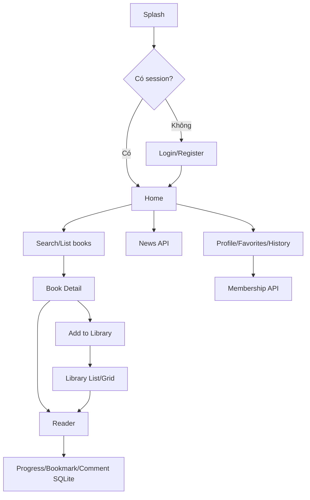

# Báo cáo hoàn thiện đồ án Book Reader

## 1. Tổng quan đồ án

Book Reader là ứng dụng Flutter hỗ trợ tìm kiếm, lưu, đọc và quản lý sách. Project gồm Flutter app trong `lib/` và backend ASP.NET Core Web API trong `backend/BookReader.Api`.

## 2. Kiến trúc sau khi hoàn thiện

Ứng dụng tiếp tục giữ kiến trúc phân tầng hiện có:

- `config`: routes và theme.
- `core`: constants, HTTP client, local session, validators, shared widgets.
- `data`: models, local SQLite datasource, remote API datasource.
- `domain`: entities, repositories, use cases.
- `presentation`: pages và Provider state.
- `backend/BookReader.Api`: controllers, services, repositories, EF Core DbContext.

## 3. Chức năng đã có

| Nhóm | Chức năng | Bằng chứng |
| --- | --- | --- |
| Auth | Login, register, session local file | `sign_in.dart`, `sign_up.dart`, `AuthProvider`, `SessionStorage` |
| Home/Search | Danh sách sách, tìm kiếm, lưu sách | `home.dart`, `HomeBookProvider` |
| Book detail | Chi tiết sách, favorite, thêm thư viện | `book_detail_page.dart`, `FavoriteDao`, `LibraryProvider` |
| Library | Danh sách sách offline/remote, import file | `library_page.dart`, `OfflineBookDao` |
| Reader | WebView/TXT/local file, progress, bookmark, comment | `reader.dart`, `ReadingProgressDao`, `BookmarkDao`, `CommentPage` |
| News | API LitHub, mở URL ngoài | `news_page.dart`, `NewsProvider` |
| Profile | Thông tin user, favorite, reading history, logout | `myprofile.dart`, `editprofile.dart` |
| Membership | Gói thành viên từ backend | `membership_package_page.dart`, `MembershipApi` |

## 4. Chức năng đã bổ sung/sửa

- Đăng ký `BookProvider` trong `lib/main.dart` để tránh ProviderNotFound ở Category/Search.
- Gỡ mock login/register không kiểm soát trong `AuthProvider`; API lỗi sẽ trả lỗi thật.
- Dùng `currentUser.userId` cho Library, Membership, Reader thay vì hardcode `userId: 1`.
- Chuyển tab Library mở thẳng `LibraryPage`.
- Thêm chế độ GridView/ListView trong `LibraryPage`.
- Thêm validators dùng chung trong `lib/core/utils/validators.dart`.
- Tăng validation cho Sign in, Sign up, Forgot password, New password, Edit Profile, Comment.
- Reader tự load reading progress đã lưu.
- Reader xử lý PDF/EPUB local bằng `open_filex` để mở bằng ứng dụng ngoài.
- Reader có nút `Lưu bookmark` trên AppBar cho WebView, TXT, PDF/EPUB local và PDF/EPUB remote.
- Reader hiển thị thông báo rõ rằng PDF/EPUB mở bằng ứng dụng đọc tài liệu ngoài, nhưng bookmark vẫn lưu trong Book Reader.
- Home Continue Reading lấy top 5 progress từ SQLite, bỏ progress 0%, sort theo `progress_percent` giảm dần và mở Reader tại `current_page`.
- Profile Reading History chỉ giữ/hiển thị 10 progress mới nhất và có nút xóa từng progress với dialog xác nhận tiếng Việt.
- Library Downloaded hiển thị sách có `isDownloaded`, có `localFilePath`, hoặc `source == local_import`.
- Profile favorite card ẩn số tim giả để không còn hiện `0`.
- Drawer/Menu có banner `Book Reader` và subtitle `Read, save and continue your books`.
- Sửa `GoogleBooksApi` dùng `String.fromEnvironment` trực tiếp để Google Books API key là optional qua `--dart-define=GOOGLE_BOOKS_API_KEY=...`.
- Sửa widget test mặc định thành smoke test phù hợp với app.
- Tạo tài liệu Firebase setup thay vì thêm runtime Firebase thiếu config.

## 5. Luồng nghiệp vụ chính



## 6. SQLite

SQLite database `book_reader.db` được tạo tại `lib/data/datasources/local/sqlite/app_database.dart`.

| Bảng | DAO | Chức năng |
| --- | --- | --- |
| `offline_books` | `OfflineBookDao` | Lưu/xem/xóa sách offline |
| `reading_progress` | `ReadingProgressDao` | Lưu/xem/xóa tiến độ đọc, lấy top Continue, lấy 10 lịch sử gần nhất, trim bản ghi cũ |
| `bookmarks` | `BookmarkDao` | Thêm/xem/xóa bookmark |
| `comments` | `CommentDao` | Thêm/xem bình luận |
| `user_profile` | `ProfileDao` | Lưu/xem/sửa profile local |
| `favorites` | `FavoriteDao` | Thêm/xóa/xem favorite |

## 7. API/backend

Flutter gọi backend qua `ApiClient` và các datasource trong `lib/data/datasources/remote/api/`.

Backend ASP.NET Core dùng mô hình:

```text
Controller -> Service -> Repository -> BookReaderDbContext -> SQL Server
```

Các API chính: Auth, Books, Library, Reading Progress, Bookmarks, Notes, Membership.

## 8. Multimedia/device feature

- `file_picker`: import file `txt`, `pdf`, `epub` trong Library.
- `webview_flutter`: đọc sách online bằng WebView.
- `url_launcher`: mở bài viết LitHub bằng trình duyệt ngoài.
- `open_filex`: mở PDF/EPUB local bằng ứng dụng ngoài.
- `path_provider`/`dart:io`: lưu session và file local.

## 9. Firebase status

Firebase chưa được tích hợp runtime vì thiếu cấu hình Firebase an toàn. Đã tạo `docs/firebase_setup_guide.md` để hướng dẫn tích hợp sau này mà không phá backend auth hiện có.

## 10. Kết quả kiểm thử

| Hạng mục | Kết quả |
| --- | --- |
| `flutter pub get` | Thành công |
| `dart format .` | Thành công |
| `flutter analyze` | No issues found |
| `flutter test` | All tests passed |
| `flutter build apk --debug` | Thành công, tạo `app-debug.apk` |
| `dotnet restore` | Thành công |
| `dotnet build` | Thành công, 0 warning, 0 error |

Chi tiết nằm trong `docs/final_validation_report.md`.

## 11. Hạn chế còn lại

- Firebase chưa chạy thật do thiếu config.
- Một số provider cũ vẫn còn trong repo nhưng không thuộc flow chính.
- Reader chưa render PDF/EPUB nội bộ; hiện mở bằng app ngoài và bookmark PDF/EPUB là bookmark cấp tài liệu.
- Một số text trong source cũ có thể còn lỗi encoding hiển thị.
- Comment local chưa có sửa/xóa trên UI.

## 12. Hướng phát triển

- Thêm Firebase Storage cho avatar nếu có config.
- Thêm PDF/EPUB reader nội bộ nếu package ổn định.
- Chuẩn hóa toàn bộ text tiếng Việt UTF-8.
- Viết thêm unit test cho model mapping và validators.
- Dùng token/current user từ backend thay query `userId` ở mọi endpoint.
